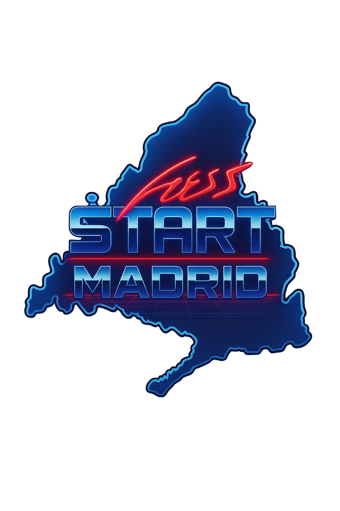

<p align="center">
  
</p>

<h1 align="center">Press Start Madrid</h1>

es un proyecto web desarrollado para la promoción del **alquiler de máquinas de pinball y recreativas** para eventos en Madrid.

La web está orientada a presentar el servicio de forma clara, visual y directa, facilitando el contacto con clientes interesados en llevar la experiencia arcade y retro a sus eventos.

---

## 🎯 Objetivo del proyecto

El objetivo principal de **Press Start Madrid** es servir como plataforma digital para:

- Promocionar el alquiler de máquinas de pinball, arcade, billar, diana...
- Mostrar el tipo de eventos en los que se ofrece el servicio
- Facilitar el contacto con clientes potenciales
- Transmitir una estética retro/gaming alineada con el producto

---

## 🕹️ Tipo de eventos

El servicio está pensado para:

- Eventos corporativos
- Ferias y exposiciones
- Fiestas privadas
- Eventos temáticos gaming y retro
- Celebraciones y actividades recreativas

---

## 🛠️ Tecnologías utilizadas

<p align="center">
  
</p>

- **HTML5** para la estructura del contenido
- **CSS3** para el diseño visual y la estética retro
- **JavaScript** para interacciones y comportamiento dinámico
- Dominio propio y despliegue web

---

## 🌐 Sitio web

👉 **Web oficial:**  
https://www.pressstartmadrid.es

---

## 📁 Estructura del proyecto

```text
/
├── index.html
├── css/
│   └── styles.css
├── js/
│   └── main.js
├── assets/
│   └── images/
└── README.md
